# 实验索引

> 本文件由 `scripts/build_docs_index.py` 从 `results/metrics.csv` 自动生成，请勿手工编辑。

全部为**跨被试 OOF**：每折训练时完全未见测试被试。`overall_acc` 为窗口池口径，
**准确率主数为被试均值口径**（与报告一致）；「窗口池」列在两者相同时记 ＝。
素材类两口径数学恒等；自评类因存在无效标签（观影 3.64%、讲述 3.48%）相差 0.04–0.27 点。

## 基线

| # | 实验 | n | 类别 | 随机 | 准确率(被试均值) | 窗口池 | 倍数 | 召回>20%的类 | 视频内恒定率 | ρ vs 素材编号 |
|---|---|---|---|---|---|---|---|---|---|---|
| 01 | FACED 素材9 | 123 | 9 | 11.1% | **60.73%** | ＝ | 5.47× | 9/9 | 98.9% | +0.13 (p=0.732) |
| 02 | TY 观影 素材9 | 52 | 9 | 11.1% | **30.02%** | ＝ | 2.70× | 9/9 | 97.8% | +0.22 (p=0.576) |
| 03 | TY 讲述 素材9 | 118 | 9 | 11.1% | **14.89%** | ＝ | 1.34× | 2/9 | 98.1% | +0.52 (p=0.154) |
| 04 | TY 观影 自评8 | 52 | 8 | 12.5% | **26.16%** | 26.09% | 2.09× | 5/8 | 97.2% |  |
| 05 | TY 讲述 自评8 | 116 | 8 | 12.5% | **17.48%** | 17.43% | 1.40× | 2/8 | 98.5% |  |
| 06 | 观影 matched51 | 51 | 9 | 11.1% | **32.14%** | ＝ | 2.89× | 8/9 | 97.5% | +0.18 (p=0.637) |
| 07 | 讲述 matched51 | 51 | 9 | 11.1% | **19.00%** | ＝ | 1.71× | 4/9 | 98.4% | -0.12 (p=0.765) |

#### 01 · FACED 素材9

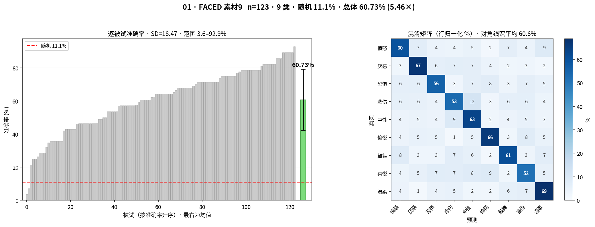

左：逐被试准确率（灰＝每被试，绿＝均值±SD，红虚线＝随机）　右：混淆矩阵（行归一化 %）

#### 02 · TY 观影 素材9

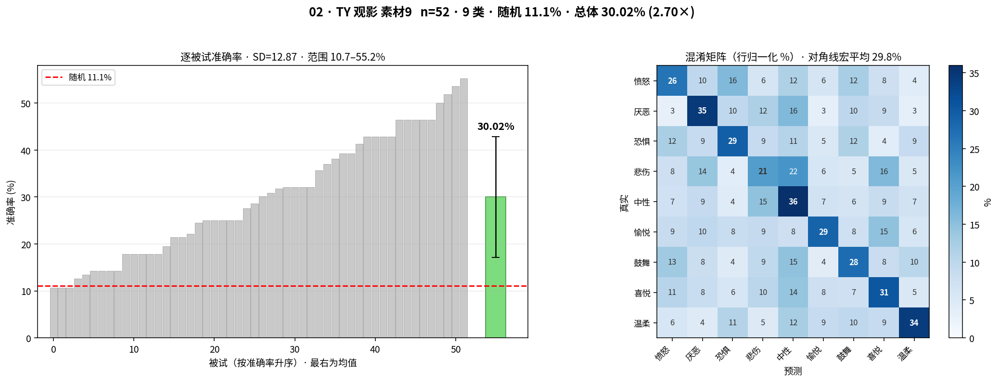

左：逐被试准确率（灰＝每被试，绿＝均值±SD，红虚线＝随机）　右：混淆矩阵（行归一化 %）

#### 03 · TY 讲述 素材9

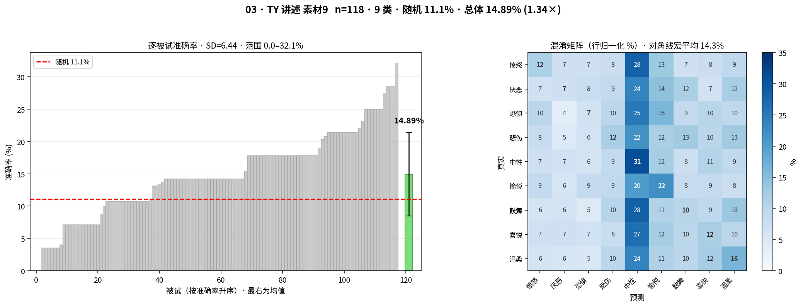

左：逐被试准确率（灰＝每被试，绿＝均值±SD，红虚线＝随机）　右：混淆矩阵（行归一化 %）

#### 04 · TY 观影 自评8

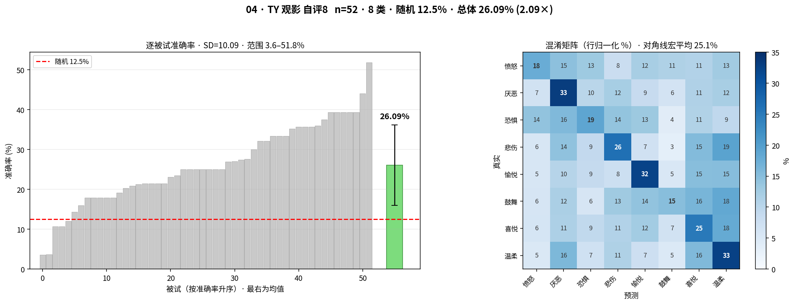

左：逐被试准确率（灰＝每被试，绿＝均值±SD，红虚线＝随机）　右：混淆矩阵（行归一化 %）

#### 05 · TY 讲述 自评8

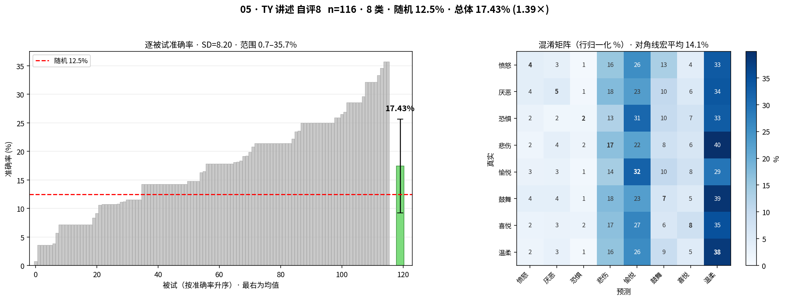

左：逐被试准确率（灰＝每被试，绿＝均值±SD，红虚线＝随机）　右：混淆矩阵（行归一化 %）

#### 06 · 观影 matched51

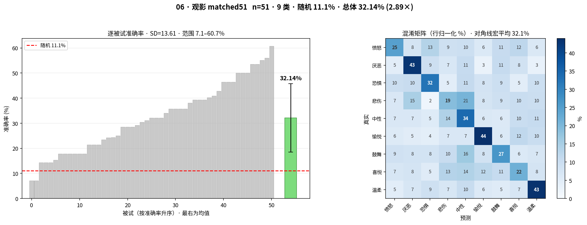

左：逐被试准确率（灰＝每被试，绿＝均值±SD，红虚线＝随机）　右：混淆矩阵（行归一化 %）

#### 07 · 讲述 matched51

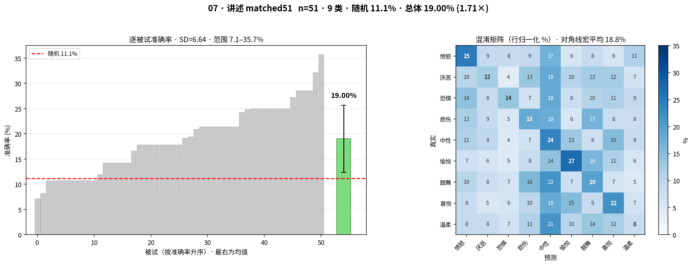

左：逐被试准确率（灰＝每被试，绿＝均值±SD，红虚线＝随机）　右：混淆矩阵（行归一化 %）

## 零样本

| # | 实验 | n | 类别 | 随机 | 准确率(被试均值) | 窗口池 | 倍数 | 召回>20%的类 | 视频内恒定率 | ρ vs 素材编号 |
|---|---|---|---|---|---|---|---|---|---|---|
| 08 | 零样本 FACED→观影 | 52 | 9 | 11.1% | **18.23%** | ＝ | 1.64× | 4/9 |  | +0.33 (p=0.381) |
| 09 | 零样本 FACED→讲述 | 118 | 9 | 11.1% | **11.02%** | ＝ | 0.99× | 0/9 |  | +0.12 (p=0.765) |
| 10 | 零样本 观影→讲述m51 | 51 | 9 | 11.1% | **13.90%** | ＝ | 1.25× | 0/9 |  | -0.33 (p=0.381) |

#### 08 · 零样本 FACED→观影

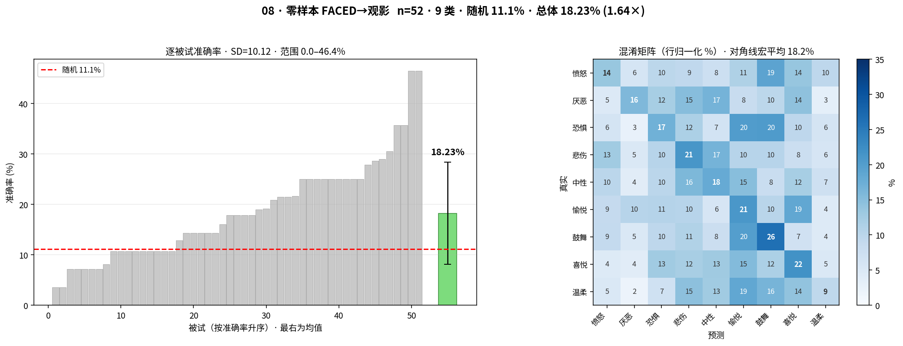

左：逐被试准确率（灰＝每被试，绿＝均值±SD，红虚线＝随机）　右：混淆矩阵（行归一化 %）

#### 09 · 零样本 FACED→讲述

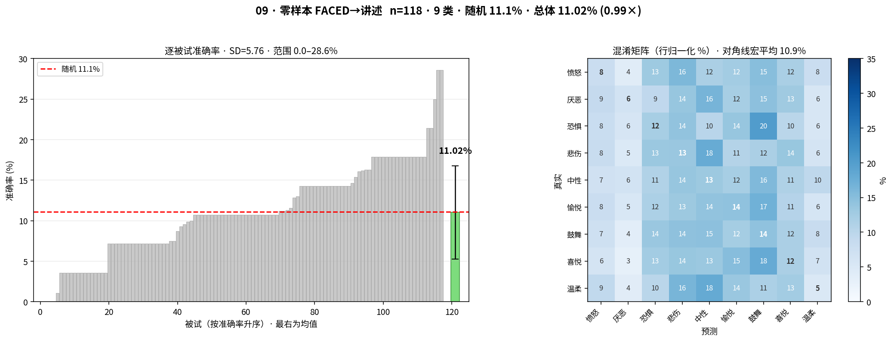

左：逐被试准确率（灰＝每被试，绿＝均值±SD，红虚线＝随机）　右：混淆矩阵（行归一化 %）

#### 10 · 零样本 观影→讲述m51

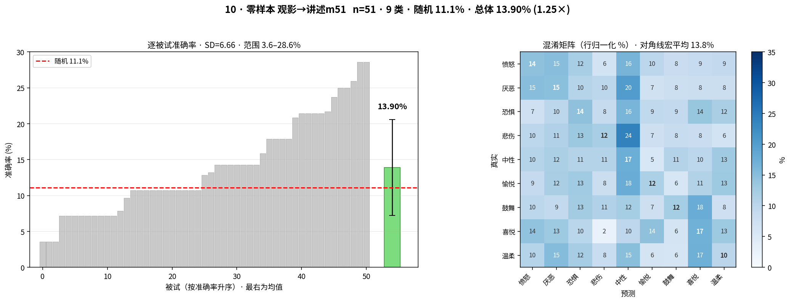

左：逐被试准确率（灰＝每被试，绿＝均值±SD，红虚线＝随机）　右：混淆矩阵（行归一化 %）

## MLP-FT

| # | 实验 | n | 类别 | 随机 | 准确率(被试均值) | 窗口池 | 倍数 | 召回>20%的类 | 视频内恒定率 | ρ vs 素材编号 |
|---|---|---|---|---|---|---|---|---|---|---|
| 11 | MLP-FT FACED→观影 | 52 | 9 | 11.1% | **27.73%** | ＝ | 2.50× | 8/9 | 98.2% | +0.10 (p=0.798) |
| 12 | MLP-FT FACED→讲述 | 118 | 9 | 11.1% | **15.93%** | ＝ | 1.43× | 2/9 | 98.2% | +0.57 (p=0.112) |
| 13 | MLP-FT 观影→讲述m51 | 51 | 9 | 11.1% | **17.43%** | ＝ | 1.57× | 3/9 | 98.0% | +0.30 (p=0.433) |

#### 11 · MLP-FT FACED→观影

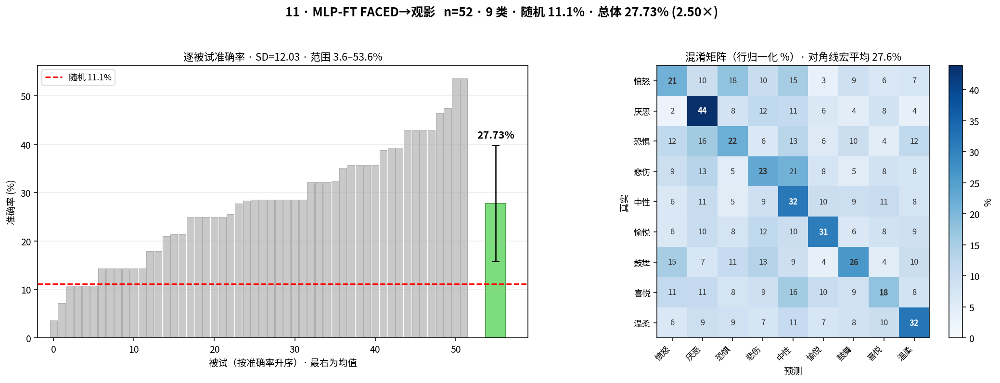

左：逐被试准确率（灰＝每被试，绿＝均值±SD，红虚线＝随机）　右：混淆矩阵（行归一化 %）

#### 12 · MLP-FT FACED→讲述

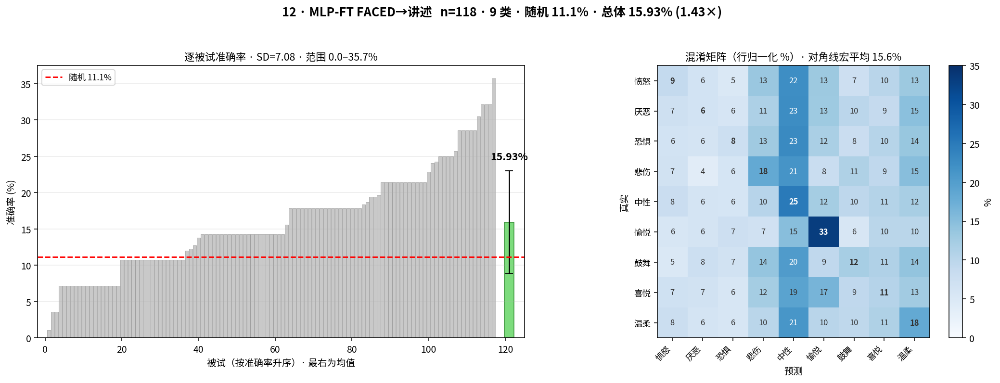

左：逐被试准确率（灰＝每被试，绿＝均值±SD，红虚线＝随机）　右：混淆矩阵（行归一化 %）

#### 13 · MLP-FT 观影→讲述m51

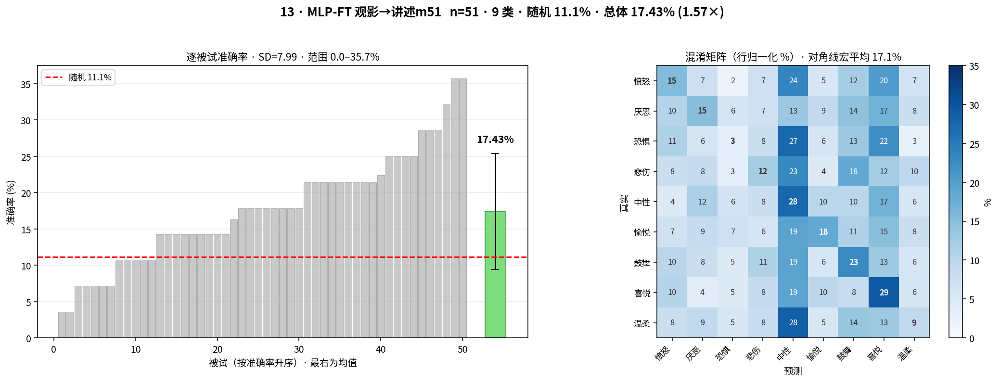

左：逐被试准确率（灰＝每被试，绿＝均值±SD，红虚线＝随机）　右：混淆矩阵（行归一化 %）

## 消融

| # | 实验 | n | 类别 | 随机 | 准确率(被试均值) | 窗口池 | 倍数 | 召回>20%的类 | 视频内恒定率 | ρ vs 素材编号 |
|---|---|---|---|---|---|---|---|---|---|---|
| 30 | 消融 讲述素材8 去中性 | 118 | 8 | 12.5% | **15.46%** | ＝ | 1.24× | 1/8 | 98.2% |  |
| 31 | 消融 讲述9 关 running_norm ⚠ | 118 | 9 | 11.1% | **14.50%** | ＝ | 1.30× | 1/9 | 99.9% | -0.09 (p=0.815) |
| 32 | 消融 讲述8 关 running_norm | 118 | 8 | 12.5% | **13.58%** | ＝ | 1.09× | 3/8 | 99.6% |  |

#### 30 · 消融 讲述素材8 去中性

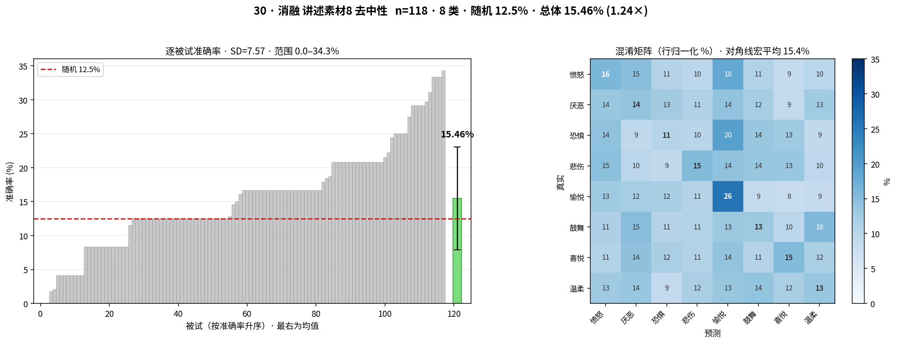

左：逐被试准确率（灰＝每被试，绿＝均值±SD，红虚线＝随机）　右：混淆矩阵（行归一化 %）

#### 31 · 消融 讲述9 关 running_norm ⚠ **分类器塌陷，该准确率不代表有效性能**

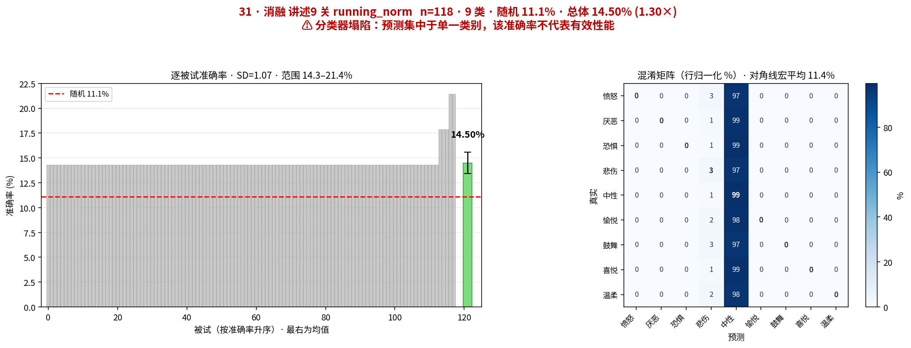

左：逐被试准确率（灰＝每被试，绿＝均值±SD，红虚线＝随机）　右：混淆矩阵（行归一化 %）

#### 32 · 消融 讲述8 关 running_norm

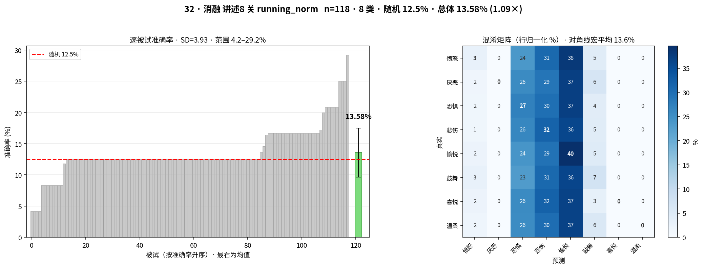

左：逐被试准确率（灰＝每被试，绿＝均值±SD，红虚线＝随机）　右：混淆矩阵（行归一化 %）

> **⚠ 标记的实验分类器已塌陷**，其准确率约等于最大类占比，不代表有效性能：

> - 31 消融 讲述9 关 running_norm：分类器塌陷：预测坍向第 4 类（召回 99.4%），其余类接近 0；准确率约等于该类占比，非有效性能

## 派生指标

- **同人差（matched51，同一批 51 人）**：观影 32.14% − 讲述 19.00% = **+13.1 点**。这是唯一控制了个体差异的比较。

## 位置混杂检验

对每个素材九类实验，计算九类召回率与该情绪素材编号位置（videoIndex 中点 `2,5,8,11,14.5,18,21,24,27`，中性因含 4 个视频取 14.5）的 Spearman 相关。

**12 项全部不显著**（|ρ| ≤ 0.57，p ≥ 0.112），说明主线设置下「情绪好不好认」与它排第几号素材无关。

自评类两臂未纳入：其标签为每被试自评分 argmax，同一视频在不同被试上标签不同，不存在固定的「情绪↔素材编号」对应，该检验不适用。

## 有效样本粒度

视频内预测恒定率 97–99%（见上表），故有效样本单位为 **28 个视频**而非 840 个窗口，所有被试准确率均为 1/28 的整数倍。`results/oof_video_level/` 收录的即为该粒度。
